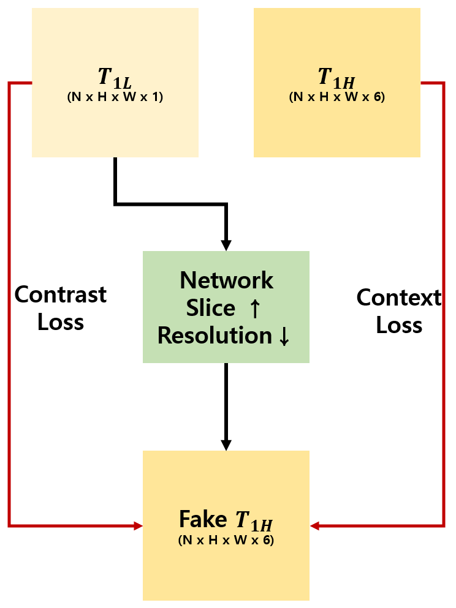
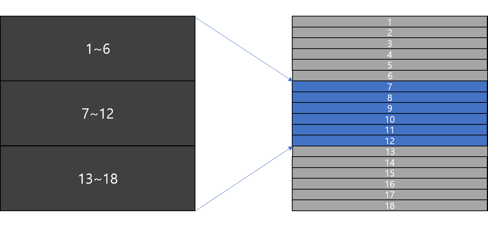
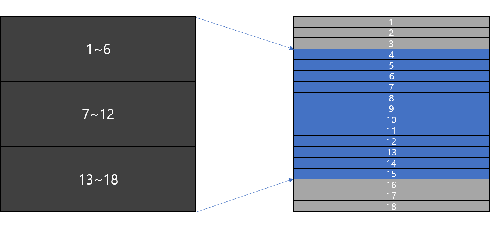

# MRI_translation

- Interpolation MRI T1 Image
- Figure of Flow

## Data Information
- Input
    - Low resolution T1
    - Thickness : 6mm
    - Shape
        - Batch x Height x Width x 3
- Output
    - High resolution T1
    - Thickness : 1mm
    - Shape
        - Batch x Height x Width x 9 
        - Batch x Height x Width x 12
    
## Network Architecture

- Gnerative Adversarial Network
    - Generator
        - Backbone : VGG16, Resnet, Xepction, MobileNet, DenseNet
    - Discriminator
        - Backbone : VGG16, Resnet, Xepction, MobileNet, DenseNet
        
## Training Method
- Similarity Loss : Mean Square Error

## 1st Approach

## 2nd Approach

## To do list
- [X] Reading Data
- [X] Build Generator Architecture
- [X] Build Discriminator Architecture
- [X] Define Loss Function
- [X] Making Data Generator 
- [X] Training Netrowk

